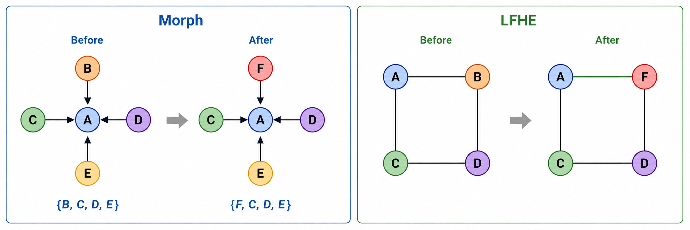

# LFHE Workshop 2026 Scaling Experiments

This repository studies when bounded local topology evolution remains effective as decentralized learning systems scale.


## Research Question

When does bounded local topology evolution remain effective as decentralized systems scale?

## Method Overview

LFHE uses local friends-of-friends discovery and bounded topology transactions to evolve a communication graph without a central optimizer. The workshop suite evaluates how this mechanism behaves as client count, data regime, degree budget, graph mixing, participation, and link reliability change.



## Key Dimensions

| Dimension | Repository evidence |
|---|---|
| Client population | N=10 alignment runs and N=50/100/200/500 scaling manifests |
| Data regime | Fixed-total and fixed-per-client manifest families |
| Degree budget | Fixed-degree and increasing-degree configurations |
| Graph mixing | Ring, Static Random, Epidemic, DissDL, Morph, LFHE, Random-FoF, and LFHE-PAC variants |
| Communication cost | Degree, participation, link-failure, stale-view, and candidate-reach settings encoded in manifests |
| Transaction behavior | Checkpoint/resume logic, shared initial topology hashes, topology delta logs, and validation tests |

## Results Status

The checked-in repository preserves experiment code, manifests, validation tests, and cluster infrastructure. It does **not** currently track finalized numeric scaling-result tables or bulk generated outputs.

Verified claims from tracked provenance:

- `manifests/mira_core.csv` contains 194 experiment rows.
- `manifests/mira_all.csv` contains 413 experiment rows and reuses the Core output directories for its first 194 rows.
- `manifests/workshop_main_shared_static_init_n50_500.csv` contains the 120-run N={50,100,200,500}, seeds 42-46 shared-initial-topology comparison.
- `EXPERIMENT_PLAN.md` defines staged promotion gates, stopping thresholds, and optional feasibility/scaling studies.
- `tests/` and `validate_stage.py` check manifest consistency, topology invariants, validation contracts, and checkpoint/resume behavior.

Do not extract TODO tables from draft manuscripts as results. Add final README result tables only after the frozen output summaries or final submission figures are available as provenance.

## Current Figures

The current README uses method/experiment-design figures only:

- `figures/lfhe_topology_evolution_overview.png`, copied from `images/overview.png`.
- `figures/lfhe_morph_comparison.png`, copied from `images/morph_lfhe.png`.

No manuscript PDF screenshots are used, and no generated result plot is promoted as final scaling evidence in this staging branch.

## Reproduction

Use a Python environment with PyTorch, torchvision, NumPy, NetworkX, SciPy, psutil, and pytest. Stage CIFAR-10 before compute-node execution if compute nodes have no internet access. Set `LFHE_DATA_ROOT` to the staged dataset directory when needed.

```bash
python -m py_compile main.py lfhe.py morph.py dissdl.py epidemic.py run_manifest_row.py generate_mira_manifest.py validate_stage.py
python -m pytest -q
```

Generate the checked-in Core and All manifests reproducibly:

```bash
python generate_mira_manifest.py --level core --output manifests/mira_core.csv
python generate_mira_manifest.py --level all --output manifests/mira_all.csv
```

Submit the main Mira suites:

```bash
sbatch slurm/run_core_mira.sbatch
sbatch slurm/run_all_mira.sbatch
```

Core and All must not run concurrently because they intentionally share output directories for the Core subset.

## Shared Static-Random Initial Topology Suite

`manifests/workshop_main_shared_static_init_n50_500.csv` is the 120-run N={50,100,200,500}, seeds 42-46 main comparison. Every row enables `--shared-initial-topology`; the common undirected graph is `bounded_connected(N,Dmax,seed)`, the same graph used by Static Random. Runs record `graph_initial_common.edgelist` and `initial_common_topology_hash`.

```bash
sbatch --array=0-119%4 slurm/run_shared_initial_main_ncc.sbatch
```

## Topology Evolution Diagnostics

PAC runs record an initial edge list and per-update edge deltas. Build a self-contained viewer from generated outputs:

```bash
python scripts/build_topology_animation.py \
  --outputs outputs/workshop_main_remaining_md_aligned_n50_500 \
  --methods random_fof lfhe \
  --output reports/topology_evolution.html
```

The builder is read-only with respect to experiment outputs and tolerates a partially appended final JSONL line.

## Repository Structure

- `main.py`: official experiment runner.
- `morph.py`, `lfhe.py`, `dissdl.py`, `epidemic.py`, `lfhe_pac.py`: topology implementations and baselines.
- `generate_mira_manifest.py`, `run_manifest_row.py`: deterministic manifest generation and row execution.
- `manifests/`: Core, All, workshop, and staged experiment manifests.
- `slurm/`: Mira/NCC submission scripts and manifest workers.
- `scripts/`: manifest generation, validation, summarization, and topology-animation utilities.
- `tests/`: regression tests for manifests, validation contracts, and topology utilities.
- `legacy/`: superseded runners and submission scripts retained for historical reference only.
- `figures/`: curated README figures.

## Provenance

See [docs/results_provenance.md](docs/results_provenance.md). Generated datasets, checkpoints, result arrays, logs, plots, scheduler outputs, and local archives are intentionally excluded from Git.

## Citation and License

No author-identifying citation or publication-status statement is included here while review constraints are uncertain. Add citation and license information only when compatible with the submission policy for this repository.
