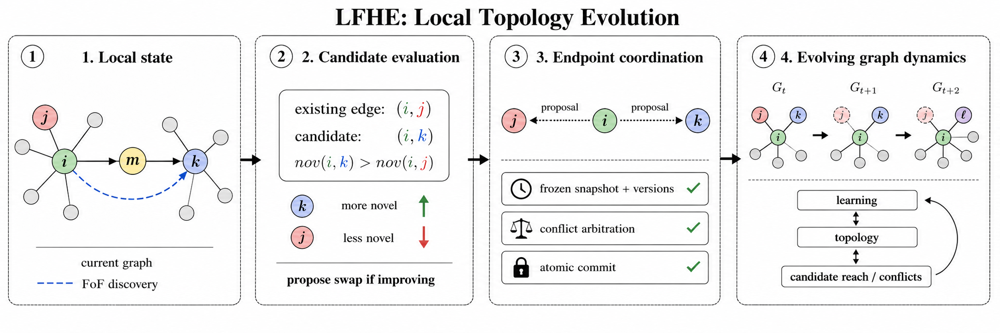

# LFHE Workshop 2026 Scaling Experiments

This repository contains the LFHE workshop experiment suite for studying how local topology evolution scales in fully decentralized learning.

## Research question

Fully decentralized learning systems must decide which peers exchange model updates without relying on a server or global graph optimizer. The central question in this repository is whether local, bounded-degree topology evolution can preserve learning quality and graph safety as the number of clients increases.

## Core method

The official experiment entry point is `main.py`. It runs the canonical LFHE protocol and scalable workshop variants, including the real Morph implementation through `MorphNode` from `morph.py`. Do not substitute Random-FoF or another topology method for Morph.

LFHE evaluates local friends-of-friends candidates, proposes topology swaps when they improve local novelty, and coordinates endpoint updates so the graph evolves while respecting degree and connectivity constraints.



## Experiment regimes

The tracked manifests cover the main workshop scaling regimes and validation studies:

| Regime | Tracked manifest or script | Scope |
|---|---|---|
| Core Mira suite | `manifests/mira_core.csv` | 194 rows |
| All Mira suite | `manifests/mira_all.csv` | 413 rows; first 194 rows reuse Core output directories |
| Shared Static-Random initial topology | `manifests/workshop_main_shared_static_init_n50_500.csv` | 120-run N={50,100,200,500}, seeds 42-46 comparison |
| Approval-gated staged workflow | `EXPERIMENT_PLAN.md`, `manifests/stage*.csv`, `validate_stage.py` | Canonical alignment, feasibility, fixed-degree scaling, and secondary stress studies |
| Topology evolution diagnostics | `scripts/build_topology_animation.py` | Builds an HTML viewer from recorded edge-list and delta logs |

Generated datasets, checkpoints, result arrays, logs, plots, and scheduler outputs are intentionally not stored in Git. The repository preserves the code, manifests, validation scripts, and operational infrastructure needed to regenerate them.

## Key findings supported by tracked provenance

The repository records the experiment design and reproducibility infrastructure rather than storing bulk generated results. The checked-in provenance supports the following claims:

- The Core Mira suite contains 194 manifest rows, and the All Mira suite contains 413 rows.
- The shared-initial-topology main suite contains 120 rows for N={50,100,200,500} and seeds 42-46.
- `EXPERIMENT_PLAN.md` defines the staged promotion gates, validation thresholds, and optional feasibility studies used to separate submission-critical scaling evidence from exploratory extensions.
- `validate_stage.py` and the test suite check manifest consistency, topology invariants, checkpoint/resume behavior, and validation contracts.

Do not report numeric accuracy, runtime, communication, or memory results from this repository unless they are regenerated from the manifests or verified from separately archived experiment outputs.

## Quick start

Use a Python environment with PyTorch, torchvision, NumPy, NetworkX, SciPy, psutil, and pytest. Stage CIFAR-10 before compute-node execution if compute nodes have no internet access. Set `LFHE_DATA_ROOT` to the staged dataset directory when needed.

```bash
python -m py_compile main.py lfhe.py morph.py dissdl.py epidemic.py run_manifest_row.py generate_mira_manifest.py validate_stage.py
python -m pytest -q
```

## Reproducing reported experiments

Generate the checked-in Core and All manifests reproducibly:

```bash
python generate_mira_manifest.py --level core --output manifests/mira_core.csv
python generate_mira_manifest.py --level all --output manifests/mira_all.csv
```

Submit the main Mira suites:

```bash
sbatch slurm/run_core_mira.sbatch
sbatch slurm/run_all_mira.sbatch
```

Core contains 194 runs. All contains 413 runs and deliberately reuses the same output directories for its Core subset. Do not run Core and All concurrently, because two tasks must never write to the same output directory.

Each array task passes its zero-based `SLURM_ARRAY_TASK_ID` to `run_manifest_row.py`. `csv.DictReader` removes the header, so Core indices `0-193` select all 194 data rows and All indices `0-412` select all 413 data rows without skipping the first experiment or reading the header.

## Shared Static-Random initial topology suite

`manifests/workshop_main_shared_static_init_n50_500.csv` is the clean 120-run N={50,100,200,500}, seeds 42-46 main comparison. Every row enables `--shared-initial-topology`: the common undirected graph is exactly `bounded_connected(N,Dmax,seed)`, the same graph used by Static Random. Directed methods store the same neighbor set as bidirectional sender links, and PAC methods wrap the exact edge set in their protected-tree transaction state. Each run records `graph_initial_common.edgelist` and `initial_common_topology_hash`.

Submit at most four concurrent NCC jobs from the checkout root:

```bash
sbatch --array=0-119%4 slurm/run_shared_initial_main_ncc.sbatch
```

## Interactive topology evolution

PAC runs record an initial edge list and per-update edge deltas. Build a self-contained viewer that can select method, client count, and seed, then play or scrub the exact topology evolution:

```bash
python scripts/build_topology_animation.py \
  --outputs outputs/workshop_main_remaining_md_aligned_n50_500 \
  --methods random_fof lfhe \
  --output reports/topology_evolution.html
```

The builder is read-only with respect to experiment outputs and tolerates a partially appended final JSONL line, so it can also be run while jobs execute.

## Repository structure

- `main.py`: official experiment runner.
- `morph.py`, `lfhe.py`, `dissdl.py`, `epidemic.py`: topology implementations and baselines.
- `generate_mira_manifest.py`: deterministic Core/All manifest generator.
- `run_manifest_row.py`: executes one zero-based CSV data row.
- `manifests/`: Core, All, workshop, and staged experiment manifests.
- `slurm/`: Mira/NCC submission scripts and manifest workers.
- `scripts/`: manifest generation, validation, summarization, and topology-animation utilities.
- `tests/`: lightweight regression tests for manifests, validation contracts, and topology utilities.
- `legacy/`: superseded runners and submission scripts retained for historical reference only.
- `figures/`: small curated figures for public documentation.

## Completion and resume

- `SUCCESS` means the run completed.
- `checkpoint.pt` without `SUCCESS` means the run is incomplete and can resume.
- Existing `SUCCESS` directories are skipped.
- Existing incomplete checkpoint directories receive `--resume`.
- Never allow two jobs to write to one output directory.

Dataset, outputs, results, logs, checkpoints, caches, job IDs, model artifacts, result arrays, and local archives are excluded from Git. Keep these on project or scratch storage, not in commits.

## Validation

Before submission or publication, run:

```bash
python -m py_compile main.py lfhe.py morph.py dissdl.py epidemic.py run_manifest_row.py generate_mira_manifest.py validate_stage.py
python -m pytest -q
bash -n slurm/run_core_mira.sbatch
bash -n slurm/run_all_mira.sbatch
```

The older stage manifests and SLURM scripts remain in place because `validate_stage.py`, tests, and `EXPERIMENT_PLAN.md` still use that staged workflow. They are reproducibility assets, not alternative official entry points.

## Provenance

`EXPERIMENT_PLAN.md` records approval gates, stopping thresholds, and optional study boundaries. `README_LFHE_MIRA.md` provides a compact cluster-run reference. The checked-in manifests are the source of truth for intended experiment rows; generated outputs should be archived outside Git with their manifest row, command line, seed, environment, and completion marker.

## Citation and license

No author-identifying citation or publication-status statement is included here while the work may need to remain anonymous for review. Add citation and license information only when doing so is compatible with the submission policy for the repository.
